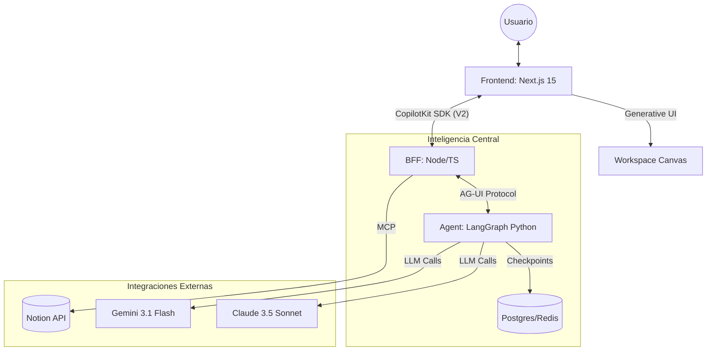

# 🏗️ Arquitectura Técnica: Purpose360 AI

## Diagrama de Flujo de Datos

## Componentes del Sistema

### 1. Frontend (`apps/frontend`)
*   **Framework:** Next.js 15 (App Router).
*   **UI/UX:** Tailwind CSS + Motion para animaciones premium.
*   **IA:** Componentes de `CopilotKit` (`CopilotPopup`, `CopilotCanvas`) que permiten al agente inyectar componentes React dinámicos (A2UI).

### 2. BFF (`apps/bff`)
*   **Runtime:** Node.js con `@copilotkit/runtime/v2`.
*   **Rol:** Centraliza la lógica de autenticación, gestión de hilos y sirve como gateway hacia los agentes de LangGraph. Implementa el protocolo **AG-UI** para comunicación en streaming.

### 3. Agent Brain (`apps/agent`)
*   **Framework:** LangGraph (Python).
*   **Lógica de Razonamiento:**
    *   **Nodes:** Definiciones de pasos (ej: `fetch_leads`, `update_notion`, `generate_plan`).
    *   **Edges:** Transiciones condicionales basadas en la intención del usuario.
*   **Middleware:**
    *   `LeadStateMiddleware`: Sincroniza el estado del Canvas con el contexto del LLM.
    *   `CopilotKitMiddleware`: Permite que el agente "vea" y ejecute herramientas definidas en el frontend.

### 4. MCP Server (`apps/mcp`)
*   Servidor basado en el **Model Context Protocol**.
*   Expone herramientas específicas de negocio (ej: gestión de leads en bases de datos propietarias) de forma estandarizada para que cualquier LLM pueda consumirlas.

## Persistencia de Datos
*   **LangGraph Checkpoints:** Almacenan el historial de la conversación y el estado interno del grafo para permitir flujos "long-running" (pausar y reanudar días después).
*   **Postgres:** Almacena metadatos de usuarios y organizaciones para el stack de Intelligence.

---
*Documento generado por Antigravity - Senior GenAI Developer.*
