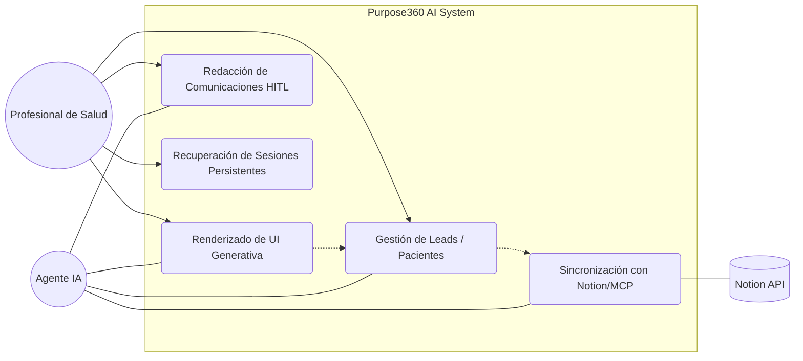

# 📋 Casos de Uso: Purpose360 AI
**Definición de Interacciones y Flujos de Usuario**  
**Rol:** Senior GenAI Developer  
**Estado:** Finalizado

Este documento describe las principales interacciones entre los actores y el sistema Purpose360 AI, detallando el valor que cada flujo aporta al profesional de la salud.

---

## 1. Diagrama de Casos de Uso

---

## 2. Descripción de Casos de Uso

### UC1: Gestión Inteligente de Leads / Pacientes
*   **Actor Principal:** Profesional de Salud / Agente IA.
*   **Descripción:** El usuario visualiza su pipeline de pacientes en el Canvas. El Agente puede filtrar, buscar y actualizar el estado de los leads mediante comandos de lenguaje natural (ej: "Muestra solo los pacientes con nivel técnico alto").
*   **Precondición:** El sistema debe estar conectado a una fuente de datos (Notion o JSON local).
*   **Flujo Principal:**
    1. El profesional solicita un cambio o consulta sobre un lead.
    2. El Agente procesa la intención y consulta el `LeadStore`.
    3. El Agente actualiza el estado visual en el Canvas y persiste el cambio en la base de datos.
*   **Postcondición:** Los datos están sincronizados y la vista del usuario actualizada.

### UC2: Renderizado de UI Generativa (GenUI)
*   **Actor Principal:** Agente IA.
*   **Descripción:** El Agente decide renderizar componentes específicos basados en el contexto de la conversación (ej: una tarjeta detallada de paciente, un gráfico de demanda o un plan de sueño).
*   **Flujo Principal:**
    1. Durante la charla, el Agente identifica que una respuesta visual es más eficiente que el texto.
    2. El Agente llama a una `FrontendTool` (ej: `renderLeadMiniCard`).
    3. El Frontend monta el componente React dinámicamente en el flujo del chat.
*   **Valor:** Mejora la toma de decisiones mediante visualización inmediata de datos clave.

### UC3: Sincronización con Ecosistema Externo (Notion/MCP)
*   **Actor Principal:** Agente IA / Notion.
*   **Descripción:** Sincronización bidireccional de datos entre el sistema y Notion usando el protocolo MCP.
*   **Flujo:**
    1. El Agente detecta una actualización de datos o creación de nota.
    2. Utiliza el servidor MCP para realizar una petición segura a la API de Notion.
    3. Notion confirma la escritura y el Agente notifica al usuario.

### UC4: Redacción de Comunicaciones con Aprobación (HITL)
*   **Actor Principal:** Profesional de Salud / Agente IA.
*   **Descripción:** El Agente redacta un correo o mensaje para un paciente, pero no lo envía automáticamente. Presenta una interfaz de edición para que el humano apruebe o modifique.
*   **Flujo (Human-in-the-Loop):**
    1. El profesional pide al agente: "Prepara un correo de bienvenida para Juan".
    2. El Agente genera un componente `EmailDraftCard` con el texto propuesto.
    3. El profesional edita el texto y presiona "Enviar".
    4. El sistema ejecuta la acción final.

### UC5: Recuperación de Sesiones Persistentes
*   **Actor Principal:** Profesional de Salud.
*   **Descripción:** El usuario cierra el navegador y, al volver días después, el Agente mantiene el contexto completo de la conversación y el estado del Canvas.
*   **Tecnología:** Uso de **Durable Threads** gestionados por Postgres.
*   **Valor:** Continuidad en flujos de trabajo profesionales largos que requieren múltiples interacciones.

---
*Documento generado por Antigravity - Senior GenAI Developer.*
