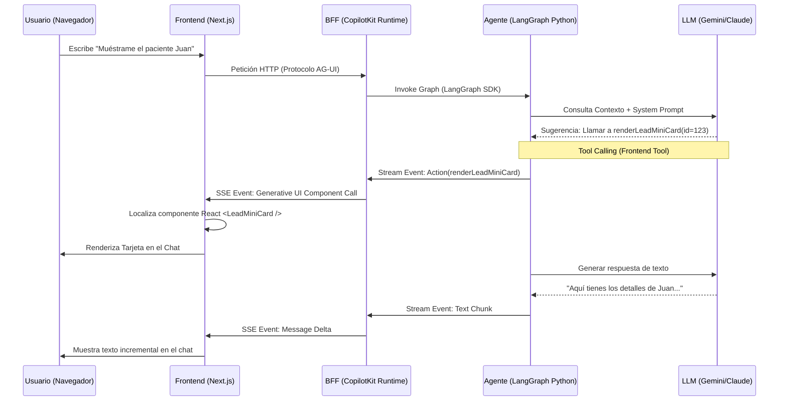
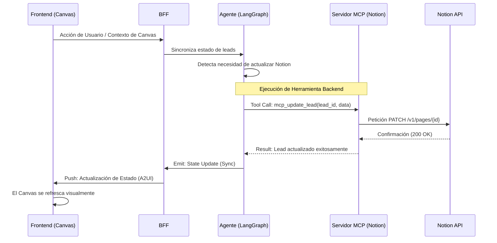

# 🔄 Diagramas de Secuencia: Purpose360 AI
**Flujos de Comunicación y Protocolo AG-UI**  
**Rol:** Senior GenAI Developer  
**Estado:** Finalizado

Este documento detalla la interacción técnica de bajo nivel entre los componentes del sistema, enfocándose en el protocolo de comunicación asíncrona y el renderizado de UI generativa.

---

## 1. Flujo de Mensaje y Renderizado GenUI
Este diagrama muestra cómo un mensaje del usuario activa una respuesta del agente que incluye un componente visual dinámico.

---

## 2. Flujo de Ejecución de Herramientas Backend (MCP/Notion)
Este diagrama detalla cómo el agente interactúa con datos externos de forma segura.

---

## 3. Protocolo AG-UI (Agent-Graphic User Interface)
El sistema utiliza el protocolo AG-UI para manejar la complejidad del streaming y la sincronización de estado:

1.  **Transporte:** Utiliza Server-Sent Events (SSE) para permitir que el Agente "empuje" actualizaciones al cliente sin que este las pida.
2.  **Mensajes de Acción:** Permite que el agente solicite al frontend que ejecute funciones locales (ej: abrir un modal, cambiar un filtro o renderizar un componente específico).
3.  **Sincronización de Estado:** El estado del Canvas se envía al BFF en cada turno (`useAgentContext`), asegurando que el LLM siempre tenga la "foto" actual de lo que el usuario está viendo.

---
*Documento generado por Antigravity - Senior GenAI Developer.*
