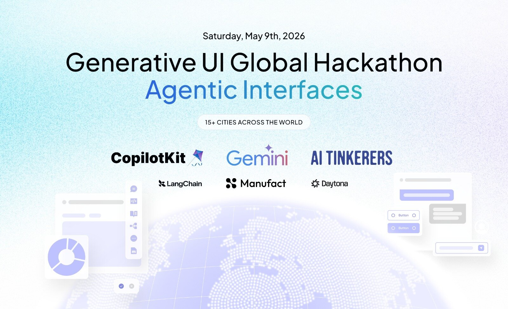

# Purpose360 AI
<!-- Notion integration configured and verified --> | Intelligent OS for Health & Wellness Professionals



## 🌟 Overview

**Purpose360 AI** is a state-of-the-art Intelligent Operating System designed specifically for healthcare and wellness professionals. It leverages the power of **CopilotKit v2**, **LangGraph**, and **Gemini 3.1** to provide an agentic interface that manages patients, content strategy, and professional growth through a seamless Generative UI experience.

Built for the **Generative UI Global Hackathon**, this project demonstrates the future of professional tools where the AI is not just a chatbot, but a co-pilot that manages the entire application state and external integrations.

---

## ✨ Key Features

- **🧠 Agent-Driven Canvas**: A dynamic workspace where an AI agent manages lead cards, follow-up notes, and pipeline charts in real-time.
- **🧵 Durable Threads**: Persistent conversation history backed by Postgres, allowing professionals to resume complex multi-day workflows.
- **🎨 Generative UI (v2)**: Rich, interactive components (A2UI) generated on-the-fly by Gemini, tailored to the specific needs of health professionals.
- **🔌 MCP Integration**: Seamless connection to external tools like **Notion** for database management and lead tracking.
- **💤 Healthcare Modules**: Specialized dashboards for Sleep Medicine, Strategic Positioning, and Patient Onboarding.

---

## 🛠️ Tech Stack

- **Frontend**: Next.js 15+, Tailwind CSS, Lucide React, Motion.
- **AI Orchestration**: [CopilotKit v2](https://copilotkit.ai) (Runtime & UI components).
- **Agent Brain**: [LangGraph](https://langchain-ai.github.io/langchain-ai/langgraph/) (Python).
- **LLM**: Google Gemini 3.1 Flash-Lite.
- **Infrastructure**: Postgres & Redis (via Docker) for thread persistence and agent memory.
- **Integration**: Notion MCP via `mcp-use`.

---

## 🚀 Quick Start

### 1. Prerequisites
- Node.js 20+
- Python 3.10+ (managed via `uv`)
- Docker Desktop (for local Intelligence stack)

### 2. Installation
```bash
# Install root and app dependencies
npm install

# Initialize CopilotKit Intelligence
npx @copilotkit/cli@latest init
```

### 3. Environment Setup
Copy the example environment file and fill in your keys:
```bash
cp .env.example .env
cp apps/agent/.env.example apps/agent/.env
```

| Key | Description |
|---|---|
| `GEMINI_API_KEY` | Get it from [Google AI Studio](https://aistudio.google.com) |
| `NOTION_TOKEN` | Your Notion Integration Token |
| `NOTION_LEADS_DATABASE_ID` | Your Notion Database ID |
| `COPILOTKIT_LICENSE_TOKEN` | Obtain via `npm run license` |

### 4. Local Development
```bash
# Start infrastructure and all apps (UI, BFF, Agent)
npm run dev
```

---

## 🌐 Deployment

### Frontend & BFF (Vercel)
The project is configured for seamless monorepo deployment on Vercel. 
- **Frontend**: Set root directory to `apps/frontend`.
- **BFF**: Set root directory to `apps/bff` (deployed as a Serverless Function).

### Agent (LangGraph Cloud)
Deploy the Python agent in `apps/agent` to **LangGraph Cloud** or **Railway** for persistent execution.

---

## 🔒 Security & Environment Variables
**Never commit your `.env` files.** The project includes a `.gitignore` that protects your secrets. In production, use **Vercel Environment Variables** and **GitHub Secrets** to manage your keys securely.

---

## 📄 License
MIT License - Developed for the Generative UI Global Hackathon 2026.
